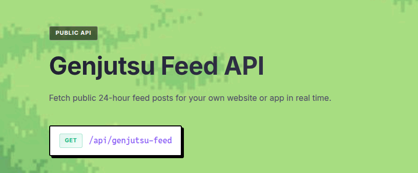

<div align="center">
  
  <h1>genjutsu 幻術</h1>
  <p><i>a social network for developers where everything disappears after 24 hours</i></p>

<p>
    <a href="https://genjutsu-social.vercel.app"></a>
    <a href="https://iamovi.github.io/genjutsu"></a>
    <a href="https://github.com/iamovi/genjutsu/blob/main/LICENSE"></a>
    <a href="https://github.com/iamovi/genjutsu/releases/tag/v2.1.0"></a>
  </p>
</div>

---


<br />

share code, post updates, connect with other builders. no permanent history, no clout chasing. just a daily feed that resets every morning.

<br />

## why 24 hours?

most social platforms accumulate posts forever. your late-night takes, half-baked ideas, and experimental code snippets stay online permanently. genjutsu is different.

every post, comment, and message automatically deletes after 24 hours. this means:

- you can post freely without worrying about your permanent record
- the feed stays fresh and relevant
- performance stays fast no matter how many users join

> think snapchat meets twitter, but built for developers,but for casual users too!

<br />


## genjutsu feed api



**want to use public genjutsu feed posts in your own app or website?**

visit the docs site: [https://iamovi.github.io/genjutsu/api](https://iamovi.github.io/genjutsu/api)

for a quick reference file in this repo, see [genjutsu-feed-api.md](./genjutsu-feed-api.md).

<br />

## contributing

want to contribute? see [CONTRIBUTING.md](CONTRIBUTING.md) for setup and guidelines.

<br />

## why open source?

building a social network is hard. building it alone is harder. by making genjutsu open source:

- you can see exactly how your data is handled
- you can contribute features you want
- you can learn from real production code

plus, the best developer tools are built by developers, for developers.

<br />

## license

Copyright (C) 2026 Ovi ren (iamovi) (init.ovi@gmail.com)

Licensed under GNU Affero General Public License as stated in the [LICENSE](https://github.com/iamovi/genjutsu/blob/main/LICENSE):

```text
Copyright (C) 2026 Ovi ren (iamovi) (init.ovi@gmail.com)

This program is free software: you can redistribute it and/or modify it under
the terms of the GNU Affero General Public License as published by the Free
Software Foundation, either version 3 of the License, or (at your option) any
later version.

This program is distributed in the hope that it will be useful, but WITHOUT
ANY WARRANTY; without even the implied warranty of MERCHANTABILITY or FITNESS
FOR A PARTICULAR PURPOSE. See the GNU Affero General Public License for more
details.

You should have received a copy of the GNU Affero General Public License along
with this program. If not, see https://www.gnu.org/licenses/
```

<br />

## support

- create an issue for bugs or feature requests
- join discussions in the issues tab

**support this project to keep it alive and growing or just buy me a cup of tea / coffee:**

<a href="https://www.supportkori.com/iamovi">
  
</a>

---

<div align="center">
  <i>developers who got tired of their old tweets haunting them.</i>
  <br /><br />
  
  <p>genjutsu 幻術</p>
</div>
