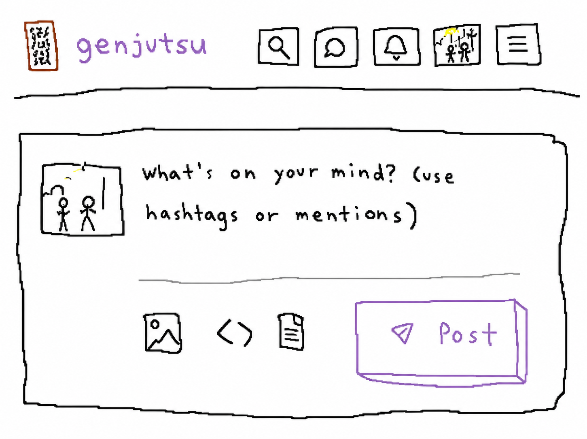
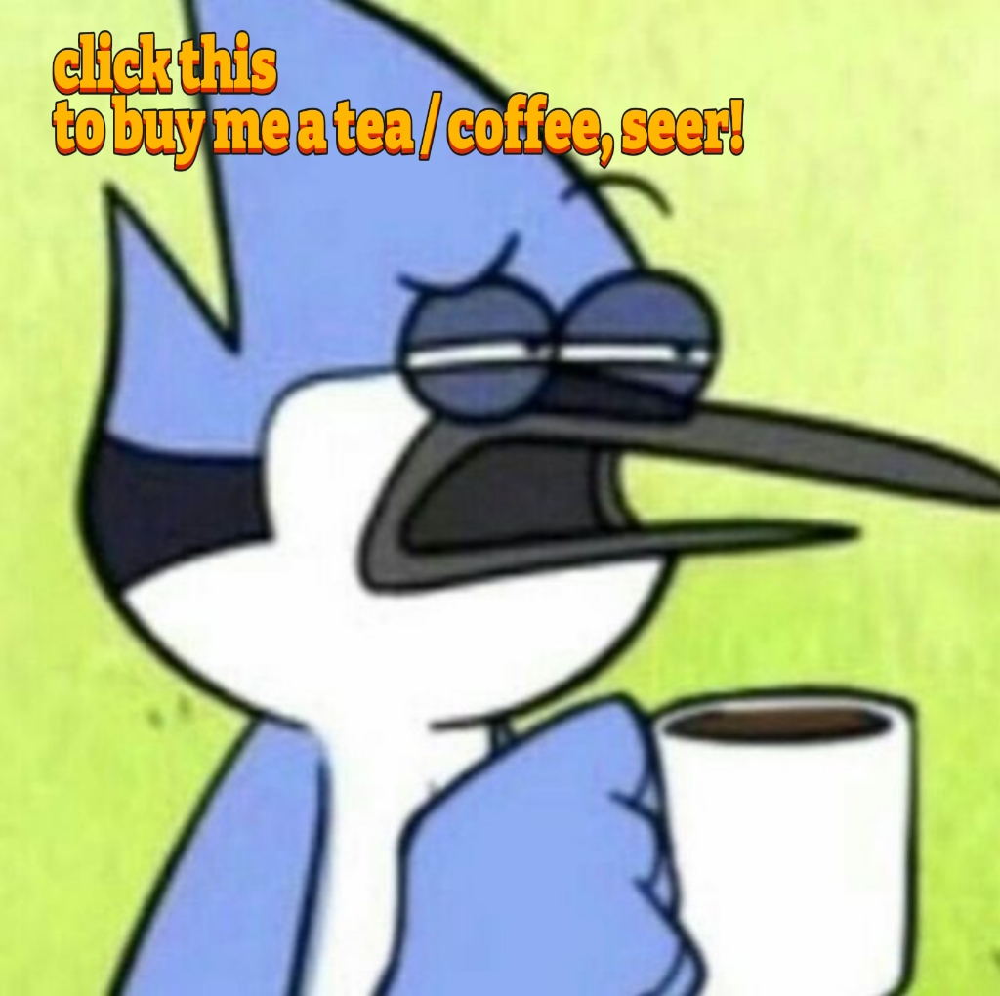

  

**Live App: https://genjutsu-social.vercel.app**

**Download App: https://iamovi.github.io/genjutsu**

`genjutsu` is a social network for developers where everything disappears after 24 hours.

share code, post updates, connect with other builders. no permanent history, no clout chasing. just a daily feed that resets every morning.

### why 24 hours?

most social platforms accumulate posts forever. your late-night takes, half-baked ideas, and experimental code snippets stay online permanently. genjutsu is different.

every post, comment, and message automatically deletes after 24 hours. this means:

◆ you can post freely without worrying about your permanent record

◆ the feed stays fresh and relevant

◆ performance stays fast no matter how many users join

think snapchat meets twitter, but built for developers.

## contributing

want to contribute? see [CONTRIBUTING.md](CONTRIBUTING.md) for setup and guidelines.

## why open source?

building a social network is hard. building it alone is harder. by making genjutsu open source:

◆ you can see exactly how your data is handled

◆ you can contribute features you want

◆ you can learn from real production code

plus, the best developer tools are built by developers, for developers.

## license

mit — see [LICENSE](../LICENSE) file

## support

◆ create an issue for bugs or feature requests

◆ join discussions in the issues tab

**◆ Support this project to keep it alive and growing or just buy me a cup of tea / coffee! Click the image below:**

---

***developers who got tired of their old tweets haunting them.***

  

  <h1>genjutsu 幻術</h1>

